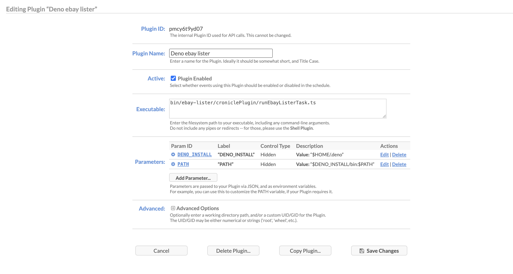

# eBay Lister

This project provides a tool for listing items on eBay. It uses the eBay API to
automate the tedious process of listing individual inventory on eBay one by one.
Instead, this service listens to the inventory API of EchoMtg, listing the card
on eBay when placed in the sale binder. The purchase price that can be set on
EchoMtg will be the listing price on eBay.

This service can be run on the CLI or can easily be run on a cron job to always
stay in sync with your EchoMtg collection.

## Features

- Automatically list items on eBay when they are added to your EchoMtg sale
  binder.
- Synchronize listing prices between EchoMtg and eBay.
- Can be run from the CLI or as a cron job.
- Generates a partial API client for the eBay API using the inventory OpenAPI
  spec.

## Configuration

The following configuration fields are required and should be set in a `.env`
file:

- `EBAY_APP_ID`: Your eBay application ID, used for authentication with the eBay
  API.
- `EBAY_CERT_ID`: Your eBay certificate ID, used for authentication with the
  eBay API.
- `EBAY_DEV_ID`: Your eBay developer ID, used for authentication with the eBay
  API.
- `EBAY_REFRESH_TOKEN`: Your eBay refresh token, used to obtain access tokens
  for the eBay API.
- `ECHO_MTG_TOKEN`: Your EchoMtg API token, used to authenticate with the
  EchoMtg inventory API.
- `ECHO_MTG_EMAIL`: Your EchoMtg account email.
- `ECHO_MTG_PASSWORD`: Your EchoMtg account password.
- `OFFER_PERCENTAGE`: The percentage of the EchoMtg purchase price to use as the
  eBay listing price.
- `MIN_UNIT_PRICE`: The minimum price for an item to be listed on eBay.

## Getting Started

To get started with this project, you will need:

- Deno installed on your machine. If you don't have Deno, you can install it by
  following the instructions on the [official website](https://deno.land/).
- A basic understanding of TypeScript.
- API credentials from eBay. You will need to create an eBay developer account
  and obtain an application ID, certificate ID, developer ID, and refresh token.
- Access to the EchoMtg inventory API. You will need an EchoMtg account email,
  password, and API token.

Before running the main process, you must first generate the eBay API client by
executing:

```bash
deno task generateClients
```

Finally you can run the ebay lister script by running

```bash
deno run -A --env-file main.ts
```

## Cronicle Custom Plugin

This project includes a custom plugin for
[Cronicle](https://github.com/jhuckaby/Cronicle) to enable seamless integration
with eBay Lister workflows.

### Features

- Triggers eBay Lister tasks on a schedule using Cronicle.
- Supports custom job parameters and environment variables.
- Handles authentication and error reporting.

### Usage

1. **Install Deno on the Server:**\
   Before running any eBay Lister tasks with Cronicle, you must have
   [Deno](https://deno.land/) installed on your server. Follow the instructions
   on the
   [official Deno website](https://deno.land/manual@v1.42.1/getting_started/installation)
   to install Deno.

2. **Copy This Project:**\
   You need to copy the entire eBay Lister project to your server or environment
   where Cronicle is running. The plugin and all related scripts depend on the
   full project structure.

3. **Configure the Plugin in Cronicle:**\
   In the Cronicle web UI, add a new Plugin and point it to the relevant script
   within this project (e.g., a wrapper or entrypoint script for the desired
   task).\
   Set up a new Event and choose the script as the handler.

4. **Set Plugin Parameters:**\
   You can pass custom parameters (such as which eBay Lister task to run) via
   the Cronicle event configuration. Cronicle will not have deno in its PATH by
   default. You will need to include it as a parameter, see example below.

5. **Environment Variables:**\
   You can specify all required env vars in cronicle. Or you can set a .env file
   at /opt/cronicle/bin

### Example Event Configuration



### Notes

- Ensure all scripts have execute permissions if needed.
- See the project source for more configuration options and usage examples.

---

For more details on Cronicle plugins, see the
[Cronicle Plugin Documentation](https://github.com/jhuckaby/Cronicle/wiki/Plugins)
